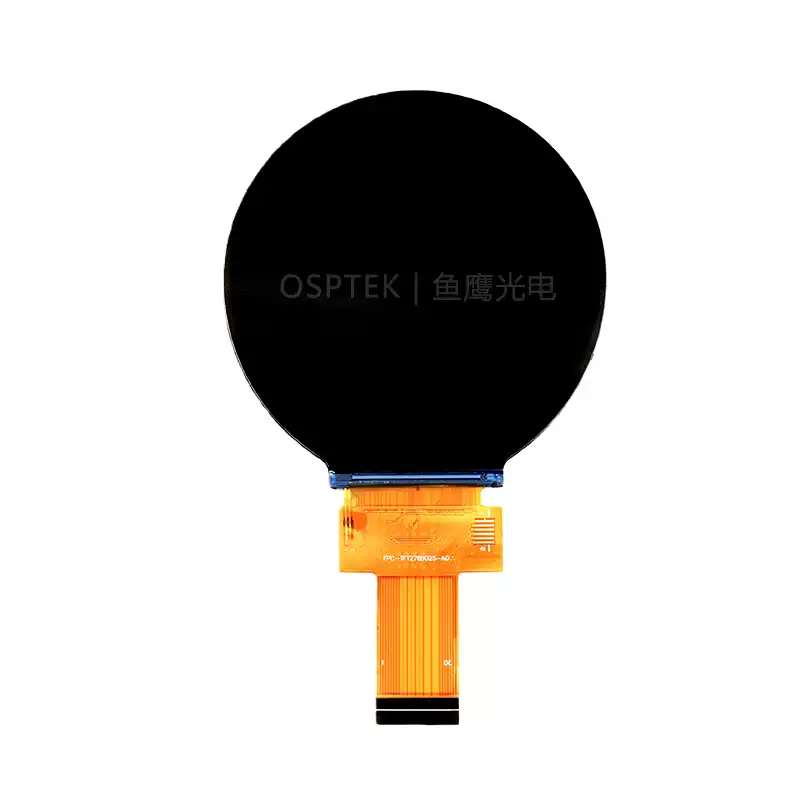

<p align="left"></p>

<h1 align="center">OSPTEK 2.76″ TFT 480×480 (ST7701 · MIPI)</h1>

<p align="center"><b>TFT / IPS module · MIPI · ST7701</b></p>

<p align="center"><a href="./README.md">简体中文</a> | English · <a href="../../README_EN.md">Family index</a></p>

<p align="center">
  
  
  
  
</p>

<p align="center"></p>

## Contents

- [Overview](#overview)
- [Specifications](#specifications)
- [Sample projects](#sample-projects)
- [Repository layout](#repository-layout)
- [Resources](#resources)
- [Buy](#buy)
- [Support](#support)

---

## Overview

OSPTEK **2.76″ 480×480 TFT (IPS)** is a **MIPI** color display module driven by **ST7701**. Suited to handheld devices, instruments, and compact square HMI.

Spec ID (repository name): `tft-2.76-480x480-mipi-st7701`

Current module version: **YDP276B004-V1**. Electrical and mechanical details follow [`docs/YDP276B004-V1.pdf`](./docs/YDP276B004-V1.pdf).

## Specifications

| Item | Spec |
| ---- | ---- |
| Size | 2.76 inch |
| Type | TFT / IPS (color) |
| Resolution | 480×480 |
| Interface | MIPI |
| Driver IC | ST7701 |

> Full outline, FPC definition, power, and timing follow the product datasheet / driver IC datasheet.

## Sample projects

| Description | Path |
| ---- | ---- |
| ESP32-P4 · ST7701 MIPI DSI + LVGL | [`examples/esp32p4-idf5_st7701-mipi-dsi/`](./examples/esp32p4-idf5_st7701-mipi-dsi/) |

## Repository layout

```text
tft-2.76-480x480-mipi-st7701/                                # repo root (nav: ../../README_EN.md)
└── versions/
    └── YDP276B004-V1/                                # full materials for this part number
        ├── README.md
        ├── README_EN.md
        ├── images/
        ├── docs/
        └── examples/
```

## Resources

### Product files

| Resource | Link |
| ---- | ---- |
| Product datasheet (YDP276B004-V1) | [`docs/YDP276B004-V1.pdf`](./docs/YDP276B004-V1.pdf) |
| Driver IC datasheet (ST7701S) | [`docs/ST_7701_S_SPEC_V1_3_f82b940377.pdf`](./docs/ST_7701_S_SPEC_V1_3_f82b940377.pdf) |
| Init sequence (C source) | [`docs/ST7701S+BOE2.76-MIPI2L.c`](./docs/ST7701S%2BBOE2.76-MIPI2L.c) |
| RGB timing parameters | [`docs/RGB时序参数.png`](./docs/RGB%E6%97%B6%E5%BA%8F%E5%8F%82%E6%95%B0.png) |

### Samples

- [ESP32-P4 ST7701 MIPI DSI + LVGL](./examples/esp32p4-idf5_st7701-mipi-dsi/)

## Buy

<p align="center">
  <a href="https://www.aliexpress.com/store/1105701619"></a>
  &nbsp;&nbsp;
  <a href="https://shop110742373.taobao.com/"></a>
</p>

**Overseas (AliExpress)**

- Store: [OSPTEK Official Store](https://www.aliexpress.com/store/1105701619)

**China (Taobao)**

- Store: [鱼鹰光电工厂店](https://shop110742373.taobao.com/)

## Support

- Technical support / product inquiry: <luyu@osptek.com>
- QQ group: **985881096**
- Website: <https://osptek.com/>
- Feel free to open an Issue in this repository with any questions

---

<p align="center"><sub>© 2026 OSPTEK · Materials in this repository are licensed under CC BY 4.0</sub></p>
